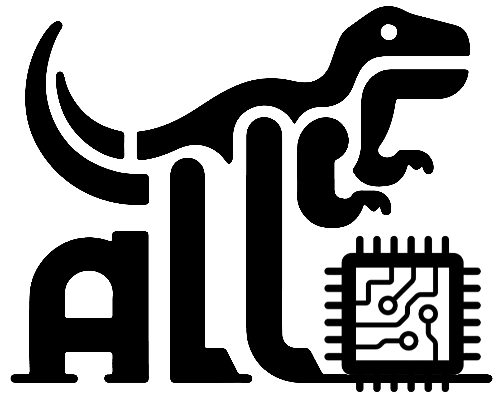

<!--- Copyright Allo authors. All Rights Reserved. -->
<!--- SPDX-License-Identifier: Apache-2.0  -->

 Accelerator Design and Programming Language
==============================================================================

[**Documentation**](https://cornell-zhang.github.io/allo) | [**Installation**](https://cornell-zhang.github.io/allo/setup/index.html) | [**Tutorials**](https://github.com/cornell-zhang/allo-tutorials)

Allo is a Python-embedded, MLIR-based language and compiler designed to facilitate the modular and composable development of large-scale, high-performance machine learning accelerators. It provides a unified abstraction for both **accelerator design and programming**, enabling developers to express complex architectures in a structured and reusable manner. Allo offers several key features:
* **Composable Design and Programming**: Allo supports both behavioral and structural composition, allowing users to incrementally build and compose accelerator components into a complete system with minimal overhead.
* **End-to-End Deployment**: Allo enables automatic accelerator generation from PyTorch models and integrates tightly with a high-performance simulator and a formal verifier, streamlining validation, testing, and deployment workflows.
* **Multiple Backend Support**: Allo currently targets AMD and Intel FPGAs as well as AMD Ryzen NPUs (AI Engine), with planned support for GPUs and ASICs in future releases.

## Getting Started

Please check out the [Allo documentation](https://cornell-zhang.github.io/allo) for installation instructions and tutorials.
If you encounter any problems, please feel free to open an [issue](https://github.com/cornell-zhang/allo/issues).

## Publications
Please refer to our [PLDI'24 paper](https://dl.acm.org/doi/10.1145/3656401) for more details. If you use Allo in your research, please cite our paper:
> Hongzheng Chen, Niansong Zhang, Shaojie Xiang, Zhichen Zeng, Mengjia Dai, and Zhiru Zhang, "**Allo: A Programming Model for Composable Accelerator Design**", Proc. ACM Program. Lang. 8, PLDI, Article 171 (June 2024), 2024.

Please also consider citing the following papers if you utilize specific components of Allo:
* [Dataflow programming model](https://arxiv.org/abs/2509.06794): Shihan Fang, Hongzheng Chen, Niansong Zhang, Jiajie Li, Han Meng, Adrian Liu, Zhiru Zhang, "**Dato: A Task-Based Programming Model for Dataflow Accelerators**", arXiv:2509.06794, 2025.
* [AIE backend](https://cornell-zhang.github.io/allo/backends/aie.html): Jinming Zhuang, Shaojie Xiang, Hongzheng Chen, Niansong Zhang, Zhuoping Yang, Tony Mao, Zhiru Zhang, Peipei Zhou, "**ARIES: An Agile MLIR-Based Compilation Flow for Reconfigurable Devices with AI Engines**", *International Symposium on Field-Programmable Gate Arrays (FPGA)*, 2025. (Best paper nominee)
* [Equivalence checker](https://github.com/cornell-zhang/allo/blob/main/allo/verify.py): Louis-Noël Pouchet, Emily Tucker, Niansong Zhang, Hongzheng Chen, Debjit Pal, Gabriel Rodríguez, Zhiru Zhang, "**Formal Verification of Source-to-Source Transformations for HLS**", *International Symposium on Field-Programmable Gate Arrays (FPGA)*, 2024. (Best paper award)
* [LLM accelerator](https://github.com/cornell-zhang/allo/tree/main/examples): Hongzheng Chen, Jiahao Zhang, Yixiao Du, Shaojie Xiang, Zichao Yue, Niansong Zhang, Yaohui Cai, Zhiru Zhang, "**Understanding the Potential of FPGA-Based Spatial Acceleration for Large Language Model Inference**", *ACM Transactions on Reconfigurable Technology and Systems (TRETS)*, 2024. (FCCM’24 Journal Track)

## Related Projects
* Accelerator Programming Languages: [Exo](https://github.com/exo-lang/exo), [Halide](https://github.com/halide/Halide), [TVM](https://github.com/apache/tvm), [Triton](https://github.com/openai/triton)
* Accelerator Design Languages: [Dahlia](https://github.com/cucapra/dahlia), [HeteroCL](https://github.com/cornell-zhang/heterocl), [PyLog](https://github.com/hst10/pylog), [Spatial](https://github.com/stanford-ppl/spatial)
* HLS Frameworks: [Stream-HLS](https://github.com/UCLA-VAST/Stream-HLS), [ScaleHLS](https://github.com/hanchenye/scalehls)
* Compiler Frameworks: [MLIR](https://mlir.llvm.org/)
